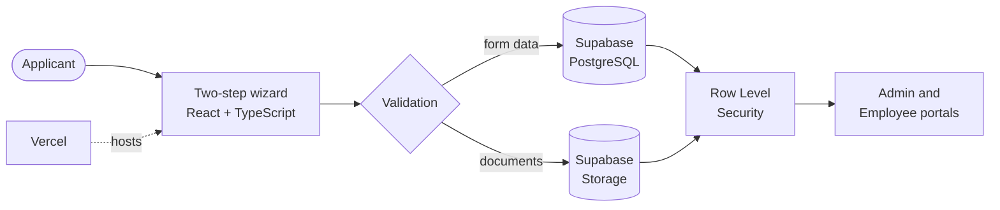

<!--
  SKYE DENVER CELESTE — PROFILE README v3
  Repo name must be exactly: dehandenver/dehandenver
  Also add: .github/workflows/profile-assets.yml  (generates the snake + 3D skyline)
  Accent: #FF007F   Deep: #7A0040
-->

<a name="top"></a>

<!-- ═════════════ HERO ═════════════ -->
<p align="center">
  
</p>

<p align="center">
  
</p>

<p align="center">
  
  
  
</p>

<p align="center">
  
  
  
  <a href="https://cic-trix.vercel.app"></a>
</p>

<p align="center">
  <a href="#about"><b>About</b></a> &nbsp;·&nbsp;
  <a href="#flagship"><b>Flagship</b></a> &nbsp;·&nbsp;
  <a href="#stack"><b>Stack</b></a> &nbsp;·&nbsp;
  <a href="#stats"><b>Stats</b></a> &nbsp;·&nbsp;
  <a href="#journey"><b>Journey</b></a> &nbsp;·&nbsp;
  <a href="#work"><b>Work with me</b></a> &nbsp;·&nbsp;
  <a href="#connect"><b>Connect</b></a>
</p>

<!-- ═════════════ ABOUT ═════════════ -->
<a name="about"></a>
<p align="center">
  
</p>

<table align="center">
<tr><td>

```bash
skye@celeste:~$ whoami
> Skye Denver Celeste: developer, builder, perpetual learner

skye@celeste:~$ cat mission.txt
> Craft clean, powerful, creative solutions that actually ship.

skye@celeste:~$ cat status.json
{
  "role":         "Full Stack Developer",
  "location":     "Western Visayas, Philippines (UTC+8)",
  "shipping":     "CICTrix HRIS (React + TypeScript + Supabase)",
  "learning":     ["systems design", "automated testing", "cloud & DevOps"],
  "fuel":         "coffee + lo-fi + stubbornness",
  "open_to":      ["freelance", "collabs", "open source", "good ideas"],
  "ask_me_about": ["React", "Supabase", "PHP", "Python", "debugging at 3AM"]
}

skye@celeste:~$ _
```

</td></tr>
</table>

<div align="center">

| | |
|:--|:--|
| 🔭 **Working on** | **CICTrix**: a full HRIS with applicant, admin and employee portals |
| 🌱 **Learning** | Systems design, automated testing, cloud & DevOps |
| 🤝 **Collaborate on** | Web apps, internal tools, open source |
| 💬 **Ask me about** | React, Supabase, PHP, Python, UI design in Figma |
| ⚡ **Fun fact** | I debug better with music on 🎧 |

</div>

<details>
<summary><b>🎮 Player card (click to expand)</b></summary>
<br>

```text
┌─ PLAYER CARD ───────────────────────────────────────────
│ NAME       Skye Denver Celeste
│ CLASS      Full-Stack Developer
│ GUILD      CICTrix HRIS
│ QUEST      Ship clean, powerful software
│
│ BACKEND    ████████░░  Supabase · PostgreSQL · PHP
│ FRONTEND   █████████░  React · TypeScript · Tailwind
│ SHIPPING   ████████░░  Vite · Vercel · Git
│ DESIGN     ███████░░░  Figma · CSS variables
│ DEBUGGING  ██████░░░░  levels up with coffee
│ LUCK       ██████████  "it works on my machine"
└─────────────────────────────────────────────────────────
```

</details>

<!-- ═════════════ FLAGSHIP ═════════════ -->
<a name="flagship"></a>
<p align="center">
  
</p>

<h3 align="center">CICTrix HRIS</h3>
<p align="center"><i>A production-style HR information system: applicant intake wizard, document uploads, and admin + employee portals, powered by Supabase.</i></p>

<p align="center">
  <a href="https://github.com/dehandenver/CICTrix">
    <picture>
      <source media="(prefers-color-scheme: dark)" srcset="https://github-readme-stats.vercel.app/api/pin/?username=dehandenver&repo=CICTrix&bg_color=000000&title_color=FF007F&icon_color=FF007F&text_color=E6EDF3&border_color=FF007F&border_radius=12&show_owner=true">
      
    </picture>
  </a>
</p>

<p align="center">
  
</p>

<p align="center">
  <a href="https://cic-trix.vercel.app"></a>
  <a href="https://github.com/dehandenver/CICTrix"></a>
</p>

<div align="center">



</div>

<div align="center">

| ✅ Highlights | What it means |
|:--|:--|
| **Two-step wizard** | Clean UX with step indicators and real-time validation |
| **Document uploads** | Drag-and-drop with file-type and size validation |
| **Secure by design** | Supabase Row Level Security and storage policies |
| **Reusable UI kit** | Modular Input, Select, Card, Dialog and Accordion components |
| **Responsive** | Mobile-first, works on every device |

</div>

<!-- ═════════════ STACK ═════════════ -->
<a name="stack"></a>
<p align="center">
  
</p>

<div align="center">

| Tier | Tools |
|:--|:--|
| ⚔️ **Daily drivers** |  |
| 🧰 **Comfortable with** |  |
| 🔬 **Exploring next** |  |

</div>

<div align="center">

| 🧭 How I build | |
|:--|:--|
| **Ship small, ship often** | Thin vertical slices beat big-bang releases |
| **Security first** | Policies at the database layer, not just the UI |
| **Components over copy-paste** | A reusable UI kit keeps screens consistent |
| **Looks matter** | Good UX is part of "it works" |

</div>

<!-- ═════════════ STATS ═════════════ -->
<a name="stats"></a>
<p align="center">
  
</p>

<p align="center">
  <picture>
    <source media="(prefers-color-scheme: dark)" srcset="https://github-readme-stats.vercel.app/api?username=dehandenver&show_icons=true&bg_color=000000&title_color=FF007F&icon_color=FF007F&text_color=E6EDF3&border_color=FF007F&border_radius=12&count_private=true&include_all_commits=true&cache_seconds=43200">
    
  </picture>
  <picture>
    <source media="(prefers-color-scheme: dark)" srcset="https://github-readme-stats.vercel.app/api/top-langs/?username=dehandenver&layout=compact&bg_color=000000&title_color=FF007F&text_color=E6EDF3&border_color=FF007F&border_radius=12&langs_count=8&cache_seconds=43200">
    
  </picture>
</p>

<p align="center">
  <picture>
    <source media="(prefers-color-scheme: dark)" srcset="https://streak-stats.demolab.com/?user=dehandenver&background=000000&border=FF007F&stroke=FF007F&ring=FF007F&fire=FF007F&currStreakNum=E6EDF3&sideNums=E6EDF3&sideLabels=FF007F&currStreakLabel=FF007F&dates=8B949E&border_radius=12">
    
  </picture>
</p>

<p align="center">
  <picture>
    <source media="(prefers-color-scheme: dark)" srcset="https://github-readme-activity-graph.vercel.app/graph?username=dehandenver&bg_color=000000&color=FF007F&line=FF007F&point=FFFFFF&area=true&area_color=FF007F&hide_border=true&title_color=FF007F&radius=12">
    
  </picture>
</p>

<h4 align="center">🧊 3D Contribution Skyline</h4>
<p align="center">
  
</p>

<h4 align="center">🐍 Contribution Snake</h4>
<p align="center">
  <picture>
    <source media="(prefers-color-scheme: dark)" srcset="https://raw.githubusercontent.com/dehandenver/dehandenver/output/github-snake-dark.svg">
    
  </picture>
</p>

<!-- ═════════════ JOURNEY ═════════════ -->
<a name="journey"></a>
<p align="center">
  
</p>

<div align="center">


</div>

<details>
<summary><b>🎯 Goals (click to expand)</b></summary>
<br>

- [x] Ship a full-stack HRIS to production
- [x] Build a killer GitHub profile 😎
- [ ] Add automated test coverage across CICTrix
- [ ] Contribute to an open-source project
- [ ] Learn Docker and deploy a containerized app
- [ ] Hit a 100-day contribution streak

</details>

<details>
<summary><b>🎲 Random things about me (click to expand)</b></summary>
<br>

- 🎧 Lo-fi beats = productivity
- 🌙 My best code gets written after midnight
- 🎨 I care about how things *look*, not only how they run
- 🐛 I name my bugs
- ☕ Coffee is a dependency

</details>

<!-- ═════════════ WORK WITH ME ═════════════ -->
<a name="work"></a>
<p align="center">
  
</p>

<div align="center">

| I can help with | Typical stack |
|:--|:--|
| 🏢 **Internal tools & portals** (HR, admin, dashboards) | React · TypeScript · Supabase |
| 🔐 **Backends with real access control** | PostgreSQL · Row Level Security · Storage |
| 🧩 **Reusable UI systems** | Tailwind · component libraries · Figma |
| 🚀 **Deploy & iterate fast** | Vite · Vercel · Git |

</div>

<p align="center"><i>Send me the problem, the deadline, and what "done" looks like. I'll tell you honestly how I'd build it.</i></p>

<!-- ═════════════ CONNECT ═════════════ -->
<a name="connect"></a>
<p align="center">
  
</p>

<p align="center"><b>💌 Got an idea, a project, or a bug that needs a hero? Let's build it together.</b></p>

<p align="center">
  <a href="https://github.com/dehandenver"></a>
  <a href="https://github.com/dehandenver?tab=followers"></a>
  <a href="https://cic-trix.vercel.app"></a>
</p>

<!-- Add your real links, then uncomment:

<p align="center">
  <a href="mailto:YOUR-EMAIL"></a>
  <a href="https://linkedin.com/in/YOUR-HANDLE"></a>
  <a href="https://facebook.com/YOUR-HANDLE"></a>
</p>

-->

<p align="center"><a href="#top">⬆️ Back to top</a></p>

<p align="center"><i>"First, solve the problem. Then, write the code." — John Johnson</i></p>

<p align="center">
  
  
</p>

<p align="center">
  
</p>
