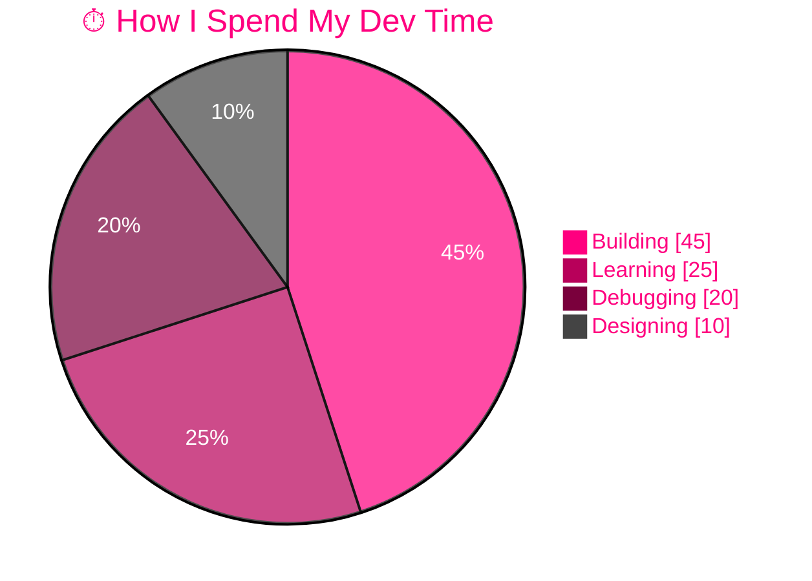
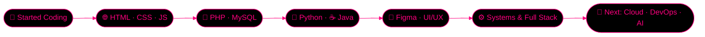

<!-- ============================================================
  SKYE DENVER CELESTE — PROFILE README
  Put this in a repo named exactly: dehandenver/dehandenver
  Search for "TODO" to find the things you should personalize.
============================================================= -->

<a name="top"></a>

<!-- 1. Animated waving header banner -->
<p align="center">
  
</p>

<!-- 2. Typing animation -->
<p align="center">
  
</p>

<!-- 3. Profile views + 4. Followers + 5. Stars -->
<p align="center">
  
  
  
</p>

<!-- 6-9. Status badges -->
<p align="center">
  
  
  
  
</p>

<!-- 10. Quick-nav bar -->
<p align="center">
  <a href="#about">👤 About</a> •
  <a href="#stack">🛠 Stack</a> •
  <a href="#stats">📊 Stats</a> •
  <a href="#projects">📁 Projects</a> •
  <a href="#journey">🗺 Journey</a> •
  <a href="#connect">📡 Connect</a>
</p>


<!-- ============================ ABOUT ============================ -->
<a name="about"></a>
<h2 align="center">⚡ About Me</h2>

<!-- 11. Terminal-style intro (neofetch vibes) -->
```bash
skye@celeste:~$ whoami
> Skye Denver Celeste — developer, builder, perpetual learner

skye@celeste:~$ cat mission.txt
> Craft clean, powerful, creative solutions that actually ship.

skye@celeste:~$ cat status.json
{
  "role":        "Full Stack Developer",
  "location":    "Western Visayas, Philippines 🇵🇭",   # TODO: edit if you want
  "currently":   ["building cool things", "learning systems design"],
  "fuel":        "☕ coffee + 🎵 lo-fi + ✨ stubbornness",
  "open_to":     ["collabs", "freelance", "open source", "good ideas"],
  "ask_me_about": ["PHP", "Python", "Java", "web design", "debugging at 3AM"]
}
```

<!-- 12. Quick facts (emoji list) -->
<table align="center">
  <tr>
    <td>🔭 <b>Working on</b></td>
    <td>Full-stack apps & system projects</td>
  </tr>
  <tr>
    <td>🌱 <b>Learning</b></td>
    <td>Advanced architecture, APIs, cloud & DevOps</td>
  </tr>
  <tr>
    <td>🤝 <b>Looking to collaborate on</b></td>
    <td>Web apps, tools, and open-source</td>
  </tr>
  <tr>
    <td>💬 <b>Ask me about</b></td>
    <td>PHP, Python, Java, UI design with Figma</td>
  </tr>
  <tr>
    <td>⚡ <b>Fun fact</b></td>
    <td>I debug better with music on 🎧</td>
  </tr>
</table>

<br>

<!-- 13. Skill meters (text bars, no external service needed) -->
<details open>
<summary><b>📈 Skill Levels (click to collapse)</b></summary>
<br>

```text
HTML / CSS   ████████████████░░░░  80%
JavaScript   ██████████████░░░░░░  70%
PHP          ██████████████░░░░░░  70%
Python       ██████████████░░░░░░  70%
Java         ████████████░░░░░░░░  60%
Figma / UI   ██████████████░░░░░░  70%
Git / GitHub ████████████████░░░░  80%
```
<sub>↑ TODO: adjust these to what feels honest to you.</sub>

</details>


<!-- ============================ STACK ============================ -->
<a name="stack"></a>
<h2 align="center">🛠 Tech Stack</h2>

<!-- 14. Core stack -->
<h4 align="center">⚔️ Main Arsenal</h4>
<p align="center">
  
</p>

<!-- 15. Exploring stack -->
<h4 align="center">🔬 Exploring / Next Up</h4>
<p align="center">
  
</p>

<!-- 16. Tool badges with logos -->
<p align="center">
  
  
  
  
  
  
</p>

<!-- 17. Mermaid pie chart: how I split my time (renders natively on GitHub) -->
<div align="center">



</div>


<!-- ============================ STATS ============================ -->
<a name="stats"></a>
<h2 align="center">📊 GitHub Stats & Metrics</h2>

<!-- 18. Stats card + 19. Top languages -->
<p align="center">
  
  
</p>

<!-- 20. Streak stats -->
<p align="center">
  
</p>

<!-- 21. Contribution activity graph -->
<p align="center">
  
</p>

<!-- 22. Trophies -->
<h3 align="center">🏆 Trophy Cabinet</h3>
<p align="center">
  
</p>

<!-- 23. Snake animation (needs a GitHub Action, see bottom of this README's setup notes) -->
<h3 align="center">🐍 Contribution Snake</h3>
<p align="center">
  
</p>

<!-- 24. Repo count / languages / license shields -->
<p align="center">
  
  
  
</p>


<!-- =========================== PROJECTS ========================== -->
<a name="projects"></a>
<h2 align="center">📁 Featured Projects</h2>

<!-- 25. Pinned-repo cards. TODO: replace REPO_NAME_1 / 2 / 3 / 4 with your real repo names -->
<p align="center">
  <a href="https://github.com/dehandenver/REPO_NAME_1">
    
  </a>
  <a href="https://github.com/dehandenver/REPO_NAME_2">
    
  </a>
</p>
<p align="center">
  <a href="https://github.com/dehandenver/REPO_NAME_3">
    
  </a>
  <a href="https://github.com/dehandenver/REPO_NAME_4">
    
  </a>
</p>

<!-- 26. Project table with status -->
<div align="center">

| 🚀 Project | 🧰 Stack | 📌 Status |
|:---|:---|:---:|
| TODO: Project One | PHP · MySQL · JS |  |
| TODO: Project Two | Python |  |
| TODO: Project Three | Java |  |

</div>


<!-- =========================== JOURNEY =========================== -->
<a name="journey"></a>
<h2 align="center">🗺 My Journey</h2>

<!-- 27. Mermaid roadmap flowchart -->
<div align="center">



</div>

<!-- 28. Goals checklist -->
<details>
<summary><b>🎯 2026 Goals (click to expand)</b></summary>
<br>

- [x] Build a killer GitHub profile 😎
- [ ] Ship 3 full-stack projects
- [ ] Contribute to an open-source repo
- [ ] Learn TypeScript & React
- [ ] Learn Docker & deploy something real
- [ ] Hit a 100-day commit streak

</details>

<!-- 29. Fun/random section -->
<details>
<summary><b>🎲 Random Things About Me</b></summary>
<br>

- 🎧 Lo-fi beats = productivity
- 🌙 Best code gets written after midnight
- 🎨 I care about how things *look*, not only how they run
- 🐛 I name my bugs
- ⚡ TODO: add your own!

</details>


<!-- ============================ FUN ============================== -->
<h2 align="center">🎵 Vibes</h2>

<!-- 30. Spotify now playing. Needs YOUR own deployment of novatorem (github.com/novatorem/novatorem).
     Until then, delete this block or it will show an error image. -->
<p align="center">
  <a href="https://open.spotify.com">
    
  </a>
</p>

<!-- 31. Random dev quote -->
<p align="center">
  
</p>

<!-- 32. Random dev joke -->
<h3 align="center">💡 Dev Laugh of the Day</h3>
<p align="center">
  
</p>


<!-- =========================== CONNECT =========================== -->
<a name="connect"></a>
<h2 align="center">📡 Let's Connect</h2>

<!-- 33-36. Social hub. TODO: replace placeholder links with your real ones -->
<p align="center">
  <a href="https://github.com/dehandenver">
    
  </a>
  <a href="https://linkedin.com/in/YOUR-HANDLE">
    
  </a>
  <a href="https://twitter.com/YOUR-HANDLE">
    
  </a>
  <a href="mailto:your-email@example.com">
    
  </a>
</p>
<p align="center">
  <a href="https://facebook.com/YOUR-HANDLE">
    
  </a>
  <a href="https://instagram.com/YOUR-HANDLE">
    
  </a>
  <a href="https://discord.com/users/YOUR-ID">
    
  </a>
  <a href="https://buymeacoffee.com/YOUR-HANDLE">
    
  </a>
</p>

<!-- 37. Call to action -->
<p align="center">
  <b>💌 Got an idea, a project, or a bug that needs a hero? Let's build it together.</b>
</p>

<!-- 38. Hire/collab CTA badge -->
<p align="center">
  <a href="mailto:your-email@example.com?subject=Let's%20collab!">
    
  </a>
</p>

<!-- 39. Back to top -->
<p align="center"><a href="#top">⬆️ Back to top</a></p>

<!-- 40. Closing quote -->
<p align="center"><i>"First, solve the problem. Then, write the code." — John Johnson</i></p>

<!-- 41-42. Twinkling wave footer -->
<p align="center">
  
</p>

<!-- ============================================================
  SETUP NOTES (delete this block when done)

  SNAKE ANIMATION (feature 23):
  Create .github/workflows/snake.yml in your dehandenver/dehandenver repo:

    name: Generate Snake
    on:
      schedule: [{ cron: "0 0 * * *" }]
      workflow_dispatch:
      push: { branches: [main] }
    permissions:
      contents: write
    jobs:
      generate:
        runs-on: ubuntu-latest
        steps:
          - uses: Platane/snk/svg-only@v3
            with:
              github_user_name: ${{ github.repository_owner }}
              outputs: dist/github-contribution-grid-snake-dark.svg?palette=github-dark
          - uses: crazy-max/ghaction-github-pages@v3.1.0
            with:
              target_branch: output
              build_dir: dist
            env:
              GITHUB_TOKEN: ${{ secrets.GITHUB_TOKEN }}

  Then run the workflow once manually from the Actions tab.
============================================================= -->
