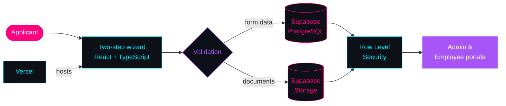
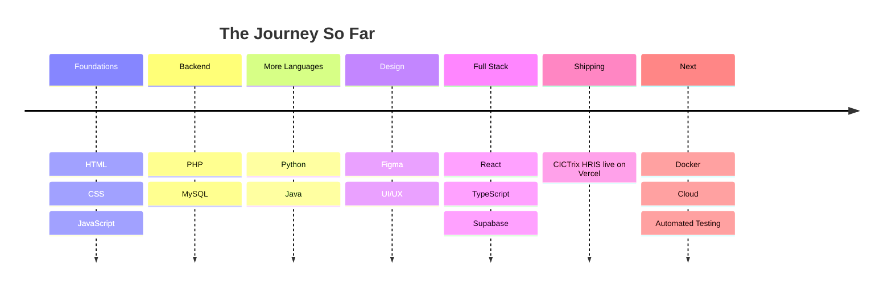

<!--
  SKYE DENVER CELESTE — PROFILE README v4
  Repo: dehandenver/dehandenver
  Theme: NEON NIGHTS — Pink #FF007F · Cyan #00F0FF · Violet #A855F7
  Also add: .github/workflows/profile-assets.yml
-->

<a name="top"></a>

<!-- ══════════════════════ HERO ══════════════════════ -->
<p align="center">
  
</p>

<p align="center">
  
</p>

<!-- ─── STATUS BADGES ─── -->
<p align="center">
  
  
  
</p>

<p align="center">
  
  
  
  <a href="https://cic-trix.vercel.app"></a>
</p>

<!-- ─── NAVIGATION ─── -->
<p align="center">
  <a href="#about"></a>
  <a href="#flagship"></a>
  <a href="#stack"></a>
  <a href="#stats"></a>
  <a href="#journey"></a>
  <a href="#connect"></a>
</p>

<!-- ══════════════════════ ABOUT ══════════════════════ -->
<a name="about"></a>
<p align="center">
  
</p>

<h2 align="center">
  
</h2>

<table align="center">
<tr><td>

```bash
skye@neon:~$ whoami
> Skye Denver Celeste — developer, builder, perpetual learner

skye@neon:~$ cat mission.txt
> Craft clean, powerful, creative solutions that actually ship.

skye@neon:~$ cat status.json
{
  "role":         "Full-Stack Developer",
  "location":     "Western Visayas, Philippines 🇵🇭",
  "timezone":     "UTC+8 (night owl mode 🌙)",
  "shipping":     "CICTrix HRIS → React + TypeScript + Supabase",
  "learning":     ["systems design", "automated testing", "cloud & DevOps"],
  "fuel":         "☕ coffee + 🎧 lo-fi + 💀 stubbornness",
  "open_to":      ["freelance", "collabs", "open source", "wild ideas"],
  "ask_me_about": ["React", "Supabase", "PHP", "Python", "3AM debugging"]
}

skye@neon:~$ echo "Let's build something legendary."
> Let's build something legendary.
skye@neon:~$ _
```

</td></tr>
</table>

<div align="center">

| | |
|:--|:--|
| 🔭 **Working on** | **CICTrix HRIS** — applicant, admin & employee portals |
| 🌱 **Learning** | Systems design · Automated testing · Cloud & DevOps |
| 🤝 **Open to** | Web apps · Internal tools · Open source collabs |
| 💬 **Ask me about** | React · Supabase · PHP · Python · Figma |
| ⚡ **Fun fact** | My best deploys happen after midnight 🌃 |

</div>

<details>
<summary><b>🎮 Player Card (click to expand)</b></summary>
<br>

```text
┌─ PLAYER CARD ──────────────────────────────────────────────────┐
│                                                                │
│  NAME       Skye Denver Celeste                                │
│  CLASS      Full-Stack Developer                               │
│  GUILD      CICTrix HRIS                                      │
│  QUEST      Ship clean, powerful software                      │
│  STATUS     ⚡ Online & building                               │
│                                                                │
│  BACKEND    ████████░░  Supabase · PostgreSQL · PHP            │
│  FRONTEND   █████████░  React · TypeScript · Tailwind          │
│  SHIPPING   ████████░░  Vite · Vercel · Git                    │
│  DESIGN     ███████░░░  Figma · CSS variables                  │
│  DEBUGGING  █████████░  powered by coffee & lo-fi              │
│  LUCK       ██████████  "it works on my machine" ™             │
│                                                                │
│  ◆ PASSIVE:  Dark mode on everything                           │
│  ◆ SPECIAL:  Can debug at 3AM without Stack Overflow           │
│  ◆ WEAKNESS: "Just one more feature..."                        │
│                                                                │
└────────────────────────────────────────────────────────────────┘
```

</details>

<!-- ══════════════════════ FLAGSHIP ══════════════════════ -->
<a name="flagship"></a>
<p align="center">
  
</p>

<h2 align="center">
  
</h2>

<h3 align="center">⚡ CICTrix HRIS</h3>
<p align="center"><i>A production-grade HR Information System: applicant intake wizard, document uploads, admin + employee portals — powered by Supabase.</i></p>

<p align="center">
  <a href="https://github.com/dehandenver/CICTrix">
    <picture>
      <source media="(prefers-color-scheme: dark)" srcset="https://github-readme-stats.vercel.app/api/pin/?username=dehandenver&repo=CICTrix&bg_color=0D1117&title_color=FF007F&icon_color=00F0FF&text_color=E6EDF3&border_color=A855F7&border_radius=12&show_owner=true">
      
    </picture>
  </a>
</p>

<p align="center">
  
</p>

<p align="center">
  <a href="https://cic-trix.vercel.app"></a>
  <a href="https://github.com/dehandenver/CICTrix"></a>
</p>

<div align="center">



</div>

<div align="center">

| ✅ Highlights | What it means |
|:--|:--|
| **Two-step wizard** | Clean UX with step indicators and real-time validation |
| **Document uploads** | Drag-and-drop with file-type and size validation |
| **Secure by design** | Supabase Row Level Security + storage policies |
| **Reusable UI kit** | Modular Input, Select, Card, Dialog & Accordion components |
| **Responsive** | Mobile-first, works on every screen size |

</div>

<!-- ══════════════════════ TECH STACK ══════════════════════ -->
<a name="stack"></a>
<p align="center">
  
</p>

<h2 align="center">
  
</h2>

<div align="center">

| Tier | Tools |
|:--|:--|
| ⚔️ **Daily Drivers** |  |
| 🧰 **Battle-Tested** |  |
| 🔬 **Leveling Up** |  |

</div>

<div align="center">

| 🧭 How I Build | |
|:--|:--|
| **Ship small, ship often** | Thin vertical slices beat big-bang releases |
| **Security first** | Policies at the database layer, not just the UI |
| **Components over copy-paste** | A reusable UI kit keeps screens consistent |
| **Looks matter** | Good UX is part of "it works" |

</div>

<!-- ══════════════════════ STATS ══════════════════════ -->
<a name="stats"></a>
<p align="center">
  
</p>

<h2 align="center">
  
</h2>

<!-- GitHub Stats + Top Languages -->
<p align="center">
  <picture>
    <source media="(prefers-color-scheme: dark)" srcset="https://github-readme-stats.vercel.app/api?username=dehandenver&show_icons=true&bg_color=0D1117&title_color=FF007F&icon_color=00F0FF&text_color=E6EDF3&border_color=A855F7&border_radius=12&count_private=true&include_all_commits=true&cache_seconds=43200">
    
  </picture>
  <picture>
    <source media="(prefers-color-scheme: dark)" srcset="https://github-readme-stats.vercel.app/api/top-langs/?username=dehandenver&layout=compact&bg_color=0D1117&title_color=00F0FF&text_color=E6EDF3&border_color=A855F7&border_radius=12&langs_count=8&cache_seconds=43200">
    
  </picture>
</p>

<!-- Streak Stats -->
<p align="center">
  <picture>
    <source media="(prefers-color-scheme: dark)" srcset="https://streak-stats.demolab.com/?user=dehandenver&background=0D1117&border=A855F7&stroke=00F0FF&ring=FF007F&fire=FF007F&currStreakNum=00F0FF&sideNums=E6EDF3&sideLabels=A855F7&currStreakLabel=00F0FF&dates=8B949E&border_radius=12">
    
  </picture>
</p>

<!-- GitHub Trophies -->
<p align="center">
  
</p>

<!-- Activity Graph -->
<p align="center">
  <picture>
    <source media="(prefers-color-scheme: dark)" srcset="https://github-readme-activity-graph.vercel.app/graph?username=dehandenver&bg_color=0D1117&color=00F0FF&line=FF007F&point=A855F7&area=true&area_color=FF007F&hide_border=true&title_color=00F0FF&radius=12">
    
  </picture>
</p>

<!-- 3D Contribution Skyline -->
<h4 align="center">🧊 3D Contribution Skyline</h4>
<p align="center">
  
</p>

<!-- Contribution Snake -->
<h4 align="center">🐍 Contribution Snake</h4>
<p align="center">
  <picture>
    <source media="(prefers-color-scheme: dark)" srcset="https://raw.githubusercontent.com/dehandenver/dehandenver/output/github-snake-dark.svg">
    
  </picture>
</p>

<!-- ══════════════════════ JOURNEY ══════════════════════ -->
<a name="journey"></a>
<p align="center">
  
</p>

<h2 align="center">
  
</h2>

<div align="center">



</div>

<!-- Currently Building -->
<h3 align="center">🔥 Currently Building</h3>

<div align="center">

| Project | Status | Stack |
|:--|:--|:--|
| **CICTrix HRIS** | 🟢 Live on Vercel | React · TypeScript · Supabase |
| **GitHub Profile v4** | 🟢 You're looking at it | Markdown · HTML · Neon Dreams |
| **Test Coverage** | 🟡 In Progress | Vitest · Testing Library |

</div>

<details>
<summary><b>🎯 Goals (click to expand)</b></summary>
<br>

- [x] Ship a full-stack HRIS to production
- [x] Build the coolest GitHub profile 😎
- [ ] Add automated test coverage across CICTrix
- [ ] Contribute to an open-source project
- [ ] Learn Docker and deploy a containerized app
- [ ] Hit a 100-day contribution streak 🔥
- [ ] Build a portfolio website

</details>

<details>
<summary><b>🎲 Random Things About Me (click to expand)</b></summary>
<br>

- 🎧 Lo-fi beats = maximum productivity
- 🌙 My best code gets written after midnight
- 🎨 I care about how things **look**, not only how they run
- 🐛 I name my bugs (current nemesis: "Gerald")
- ☕ Coffee is not a beverage, it's a dependency
- 🌃 Dark mode on everything — my eyes will thank me later
- 🎮 I think in components and render cycles

</details>

<!-- ══════════════════════ WORK WITH ME ══════════════════════ -->
<a name="work"></a>
<p align="center">
  
</p>

<h2 align="center">
  
</h2>

<div align="center">

| I can help with | Stack |
|:--|:--|
| 🏢 **Internal tools & portals** (HR, admin, dashboards) | React · TypeScript · Supabase |
| 🔐 **Backends with real access control** | PostgreSQL · Row Level Security · Storage |
| 🧩 **Reusable UI systems** | Tailwind · Component libraries · Figma |
| 🚀 **Deploy & iterate fast** | Vite · Vercel · Git |

</div>

<p align="center"><i>Send me the problem, the deadline, and what "done" looks like.<br/>I'll tell you honestly how I'd build it.</i></p>

<!-- ══════════════════════ CONNECT ══════════════════════ -->
<a name="connect"></a>
<p align="center">
  
</p>

<h2 align="center">
  
</h2>

<p align="center"><b>💌 Got an idea, a project, or a bug that needs a hero? Let's build it together.</b></p>

<p align="center">
  <a href="https://github.com/dehandenver"></a>
  <a href="https://github.com/dehandenver?tab=followers"></a>
  <a href="https://cic-trix.vercel.app"></a>
</p>

<!-- Uncomment and add your real links:
<p align="center">
  <a href="mailto:YOUR-EMAIL"></a>
  <a href="https://linkedin.com/in/YOUR-HANDLE"></a>
  <a href="https://facebook.com/YOUR-HANDLE"></a>
</p>
-->

<!-- ══════════════════════ FOOTER ══════════════════════ -->
<p align="center"><a href="#top">⬆️ Back to top</a></p>

<p align="center"><i>"First, solve the problem. Then, write the code." — John Johnson</i></p>

<p align="center">
  
  
  
</p>

<p align="center">
  
</p>
